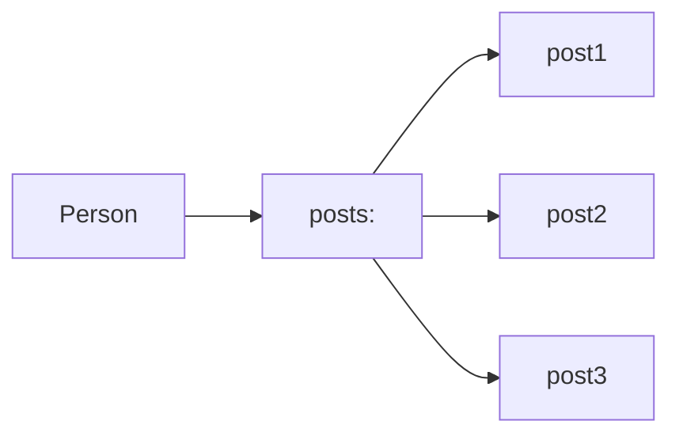
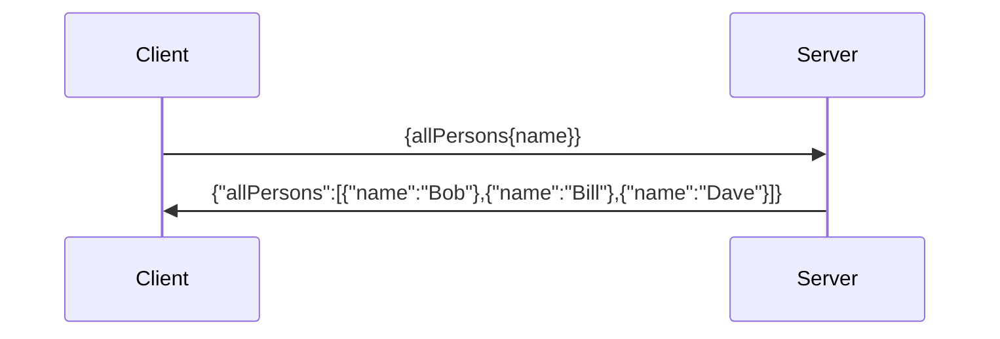

# GraphQL

[Main Site](http://graphql.org/)

## Intro

[So what’s this GraphQL thing I keep hearing about? – freeCodeCamp](https://medium.freecodecamp.org/so-whats-this-graphql-thing-i-keep-hearing-about-baf4d36c20cf)

## Tutorials

[How to GraphQL - The Fullstack Tutorial for GraphQL](https://www.howtographql.com/)

[Introduction to GraphQL | GraphQL](http://graphql.org/learn/)

## Resources

[GraphQL Weekly - Newsletter about GraphQL, Apollo and more](https://graphqlweekly.com/)


## Related

#### Clients

* Apollo
* Relay

## Alternatives

* [REST](rest)

* Falcor

----------------

## Notes 

vs Rest:

* Single endpoint for all needs
* Client specific data without any backend modifications
* ^ Which avoid fetching useless data or underfetching and requiring multiple requests for the needed data, with more overfetching

**Schema Definition Language (SDL)** -

Types are sorta classes. They are not primitives only, but can be added by declaring them:

Simple Types:

```graphql
type Person {
    name: String!
    age:Int!
}
 ```

 ```graphql
type Post {
    name: String!
}
```

(The exclamation marks signify that the field is required)

Relation: 

```graphql
type Person {
    name: String!
    age: Int!
    posts: [Post]!
}

type Post {
    title: String!
    author: Person!
}
```

Each ```Post``` must have a `Person`, and a `person` can have multiple `Post`s. (The square brackets indicate a list)

^ This example defines a **One To Many** relation between a `Person` and a `Post`. 



### **Queries** 

In the following example, **`AllPersons`** is the **_Root Field_** and everything beneath it is called the _**payload**_.
This request returns a list of all the Persons that are currently stored in the DB.

```graphql
// Request
{
    allPersons{
        name
    }
}
// Response
{
    "allPersons":[
        {"name":"Bob"},
        {"name":"Bill"},
        {"name":"Dave"}
    ]
}
```



Because the query specified only `name` as the payload, the response contained only the name of each `Person`. If `age` is requested as well,

```graphql
{
    allPersons{
        name
        age
    }
}    
```

The response would be:

```json
{
    "allPersons":[
        {"name":"Bob", "age": 35},
        {"name":"Bill", "age": 84},
        {"name":"Dave", "age": 16},
    ]
}
```

**Arguments** - each field can have 0 or more arguments, like so:

```graphql
{
    allPersons(last: 2){
        name
        age
    }
}
```

Which will only return the last 2 entries.

> Is `last` a keyword or just an example of implementation?
>> Seems like it needs to be implemented explicitly.

**Nesting** - Queries can have nested payloads, which respond with similarly nested objects from multiple types.

Request:

```graphql
{
    allPersons{
        name
        age
        posts {
            title
        }
    }
}
```

Response:

```json
{
  "data": {
    "allPersons": [
      {
        "name": "Johnny",
        "age": 23,
        "posts": [
          {
            "title": "GraphQL is awesome"
          },
          {
            "title": "Relay is a powerful GraphQL Client"
          }
        ]
      },
      {
        "name": "Sarah",
        "age": 20,
        "posts": [
          {
            "title": "How to get started with React & GraphQL"
          }
        ]
      },
      {
        "name": "Alice",
        "age": 20,
        "posts": []
      }
    ]
  }
}
```

### **Mutations**

If a client needs to manipulate the back-end data, it'll use what in graphQL is called `mutation`.

There are 3 kinds of mutations, as in any CRUD:

* **Creating** new data
* **Updating** existing data
* **Deleting** existing data

Mutations generally follow the same structure as queries, only they start with the `mutation` keyword.

```graphQL
{
    mutation{
        createPerson(name: "Waylon", age: 38) {
            name
            age
        }
    }
}
```
In this example, the _root field_ is called `createPerson`, which takes two arguments in this case. 
We also specify a payload, since mutation queries can also return useful data in their response, which avoids the need to make another request for any needed data to go along with the creation or manipulation of the back-end data.

In this case, the response would be

```json
{
    "createPerson":{
        "name": "Waylon",
        "age": "38",
    }
} 
```

Not a very useful example, since the mutation and the payload are the same, but one common case where a mutation request is followed by a query is when a created item receives a server-generated _id_. In GraphQL, a single roundtrip can both create the object and receive the server-generated parts. extending the `Person` type we defined before, 

```graphql
type Person{
    id: ID!
    name: String!
    age: Int!
}
```

Request:

```graphql
{
    mutation{
        createPerson(name: "Silly Bill", age:"42"){
            id
        }
    }
}
```

Response:

```json
{
  "data": {
    "createPerson": {
      "id": "cjbnjrt0wo2fs01802bwrbk33"
    }
  }
}
```

### Subscriptions

A _subscription_ is a steady connection of a client to the server, which sends it immediate updates upon any important event, and pushes the relevant data along with it. 
Unlike _queries_ and _mutations_ which operate in a "_request-response-cycle"_, a _subscription_ represent a _stream_ of data from the server to the client.

Much like _queries_ and _mutations_, _subscription_ follow a similar request pattern, for example:

```greaphql
subscription{
    newPerson{
        name
        age
    }
}
```

Which create a _subscription_ to events happening on the `Person` type. A connection is thus opened, and whenever a mutation is performed that creates a new `Person`, the client is delivered an object with the new item's data, as per the _payload_.

```json
{
    "newPerson": {
        "name": "Someone",
        "age": "99",
    }
}
```

### Defining a Schema

A **_schema_** specifies the capabilities of the API and defines how a client can request data through it. It is ofen described as a _contract_ between the server and the client.

A schema is generally a collection of _types_, but when defining an API schema, there are some special _**root**_ types which are used as  **_entry points_** for the requests:

* Query
* Mutation
* Subscription

```graphQL
    type Query { ... }
    type Mutation { ... }
    type Subscription { ... }
```

To implement the `allPersons` query we used earlier, we'd define

```graphql
type Query{
    allPersons: [Person!]!
}
```

Which defines `allPersons` as a _root field_. The type of `allPersons` is an array of `Person`s, since this is what the query will return.

If we want to add the `last:` argument, we'd define is as such:

```graphQL
type Query{
    allPersons(last: Int!): [Person!]!
}
```
As for `createPerson`, being a mutation request is defined using `type Mutation{...}`, like so:

```graphql
type Mutation {
    createPerson(name: String!, age: Int!): Person!
}
```

Notice that the _return type_ of the `createPerson` mutation - the `createPerson` field, is a single person object. Logically, this is the one that was created by the mutation itself.

Finally, the _subscription_ type is defined very much the same:

```graphql
type Subscription{
    newPerson: Person!
}
```
In which we define the _root field_ of `newPerson` whose type is `Person`.

**_Fulll Schema_**:

```graphql
type Query{
    allPersons(last: Int!): [Person!]!
}

type Mutation{
    createPerson(name: String!, age: String!): Person!
}

type Subscription{
    newPersons: Person!
}

type Person {
    id: ID!
    name: String!
    age: Int!
    posts: [Post!]!
}

type Post {
    title: String!
    author: Person!
}
```

Notice that this schema, while defining the `Post` type, does not allow any operation to be performed on posts. It only allows for the querying, creation and subscription to creation of object of the `Person` type. 

A more realistic version of the schema would define additional operations for both model types. We could, for example, define a CRUD style API by adding a couple of new field to the schema's root types.

Let's start be defining an `allPosts` query entry field, similar to the `allPersons` field, changing the `Query` type to:

```graphQL
type Query {
    allPersons(last: Int!): [Person!]!
    allPosts(last: Int!): [Post!]!
}
```

We're also missing a way to update or delete `Person` objects once created, so we can ass that to the `Mutation` type:

```graphQL
type Mutation {
    createPerson(name: String!, age: Int!): Person!
    updatePerson(id: ID!, name: String!, age, Int!): Person!
    deletePerson(id: ID!): Person!
}
```

> In this example, the `name` and `age` fields are required, as indicated by the exclamation mark. Does that mean that one has to update both fields each time, and cannot mutate a single one while keeping the others intact?

 We can add similar operations for the `Post` type:

```graphQL
type Mutation {
    createPerson(name: String!, age: Int!): Person!
    updatePerson(id: ID!, name: String!, age, Int!): Person!
    deletePerson(id: ID!,): Person!   
    createPost(title: String!): Post!
    updatePost(id: ID!, title: String!): Post!
    deletePost(id: ID!): Post!

}
```

(We also must add an `ID` type to the `Post` type in order for the update and delete posts to work)

We can also allow clients to subscribe to any type of event we have defined:

```graphQL
type Subscription {
    newPerson: Person!
    updatedPerson: Person!
    deletedPerson: Person!
    newPost: Post:
    updatedPost: Post!
    deletedPost: Post!
}
```

----------------

[HowToGraphQL-Basics/3 - Big Picture](https://www.howtographql.com/basics/3-big-picture/)

Note - GraphQL is merely a specification, which describes how a GraphQL server should behave (Allowed requests and response format)

Thus, in order to use GraphQL, w